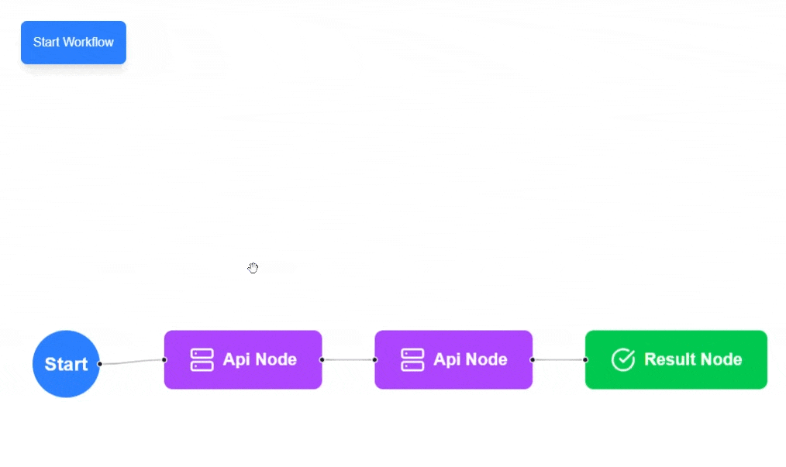
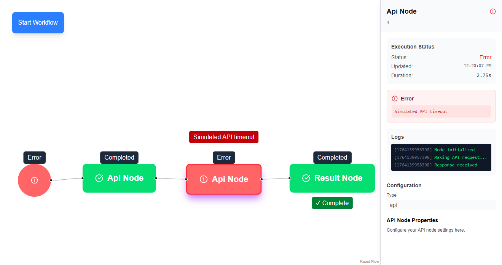

# Frozen Workflow

A real-time workflow visualization system with live node execution tracking, contextual debugging, and smooth interactive performance.

## Demo

### GIF Demo



### Screenshot



## 🚀 Live Deployment

Check out the live application here: [https://frozen-workflow.onrender.com/](https://frozen-workflow.onrender.com/)

## 📋 Project Brief

### Executive Summary

This is a high-performance, real-time workflow visualization system that scales to 100+ nodes. The solution prioritizes live synchronization with backend APIs, contextual debugging capabilities, and smooth interactive performance through WebSocket streaming, optimized state management, and efficient rendering techniques.

### Key Features

✨ **Real-Time Updates**

-   Socket.IO v4 for bidirectional communication
-   Event streaming architecture with batch updates
-   Automatic reconnection and fallback support

🎯 **Interactive Canvas**

-   React Flow-based visual workflow editor
-   Viewport virtualization for smooth 100+ node rendering

📊 **Live Node Execution**

-   Real-time node status tracking (idle, running, completed, error)
-   Visual indicators with animations
-   Per-node execution metrics and progress tracking

🐛 **Contextual Debugging**

-   Side panel with detailed node information
-   Live log streaming
-   Result preview with JSON viewer
-   Error stack traces and suggestions

⚡ **Performance Optimized**

-   State batching to prevent render thrashing
-   Component memoization
-   Memory-efficient log truncation
-   Lazy-loaded node details

🔒 **Enterprise Ready**

-   WebSocket authentication with Bearer tokens
-   Per-user workflow isolation
-   Zod schema validation
-   Comprehensive error handling

### Architecture Highlights

**Frontend Stack:**

-   React + TypeScript
-   Zustand for state management
-   React Flow for canvas
-   React Query for server state caching
-   Socket.IO client for real-time updates

**Backend Stack:**

-   Express.js server
-   Socket.IO v4 for WebSocket events
-   Zod for runtime validation
-   Node.js async execution engine

**Real-Time Event Flow:**

```
CLIENT SENDS (Workflow Execution)
├── execute:workflow { workflowId, nodeConfigs[] }
└── cancel:workflow { workflowId }

SERVER EMITS (Execution Progress)
├── node:start { nodeId, timestamp, nodeType }
├── node:running { nodeId, progress, metrics }
├── node:complete { nodeId, result, timestamp }
├── node:error { nodeId, error, errorLog, timestamp }
└── workflow:complete { workflowId, totalTime }
```

### State Management

**Zustand Store Structure:**

```typescript
interface WorkflowState {
    nodes: AppNode[];
    edges: Edge[];
    nodeStates: Map<string, NodeExecutionState>;
    workflowId?: string;
    executionStartTime?: number;
    updateNodeState(nodeId: string, state: NodeExecutionState): void;
    batchUpdateNodes(updates: Array<{ nodeId; state }>): void;
    setWorkflowId(id: string): void;
}

interface NodeExecutionState {
    status: "idle" | "running" | "completed" | "error";
    timestamp: number;
    logs: string[];
    error?: string;
    result?: unknown;
    progress?: number;
}
```

### Performance Targets

| Metric                           | Target  |
| -------------------------------- | ------- |
| Canvas responsiveness (50 nodes) | < 60ms  |
| WebSocket latency                | < 200ms |
| Initial render                   | < 1s    |
| Memory footprint (100 nodes)     | < 50MB  |
| Node re-render rate              | < 5/sec |

## 🛠️ Getting Started

### Prerequisites

-   Node.js 18+
-   npm or yarn

### Installation

**Backend Setup:**

```bash
cd backend
npm install
npm run dev
```

**Frontend Setup:**

```bash
cd frontend
npm install
npm run dev
```

The application will be available at `http://localhost:3000`

### Build for Production

**Backend:**

```bash
cd backend
npm run build
npm start
```

**Frontend:**

```bash
cd frontend
npm run build
npm start
```

## 📁 Project Structure

```
frozen_workflow/
├── backend/
│   ├── src/
│   │   ├── index.ts              # Express + Socket.IO server
│   │   ├── api/v1/               # REST endpoints
│   │   ├── services/             # Business logic
│   │   └── types/                # TypeScript definitions
│   └── package.json
│
├── frontend/
│   ├── src/
│   │   ├── app/
│   │   │   ├── components/       # React components
│   │   │   ├── hooks/            # Custom hooks
│   │   │   ├── store/            # Zustand stores
│   │   │   └── providers/        # Context providers
│   │   └── services/             # Socket.IO client
│   └── package.json
│
└── images/                        # Demo assets
```

## 🎨 Visual Status Indicators

| Status    | Color | Icon         | Animation |
| --------- | ----- | ------------ | --------- |
| idle      | gray  | -            | none      |
| running   | blue  | spinner      | pulse     |
| completed | green | checkmark    | fade-in   |
| error     | red   | alert-circle | shake     |

## 🔄 Real-Time Synchronization

1. **WebSocket Connection**: Establishes secure, authenticated connection
2. **Event Emission**: Backend emits node lifecycle events
3. **Batch Collection**: Client collects events in 100ms windows
4. **Store Update**: Zustand store updates atomically with batched changes
5. **Granular Re-renders**: Components only re-render for their specific node state changes

## 🚨 Error Handling

-   **Transient Errors**: Exponential backoff retry (100ms, 200ms, 400ms, 800ms)
-   **Permanent Errors**: Immediate failure with user message
-   **Offline Support**: Workflow snapshots saved to localStorage with resume capability
-   **Error Visibility**: Red node badges, error banners, and detailed stack traces

## 🔐 Security

-   Bearer token authentication on WebSocket connections
-   Per-user workflow isolation
-   Runtime schema validation via Zod
-   CORS configured for safe cross-origin requests

## 📈 Scalability

Designed to handle:

-   **100+ nodes** in a single workflow
-   **1000+ concurrent connections** (with load balancing)
-   **Real-time updates** with < 200ms latency
-   **Memory efficiency** through log truncation and lazy loading

## 📝 License

This project is licensed under the MIT License.
